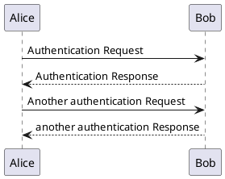

Sure, here's a blog post focused on highlighting the features of the "PlantUML SVG for Confluence" app by Grovr, written in Markdown syntax with images. I'll assume the reader is already familiar with PlantUML:

# Taking PlantUML Integration in Confluence to the Next Level

If you're a fan of PlantUML and using it to document diagrams and processes in Confluence, you'll love the "PlantUML SVG for Confluence" app by Grovr. This app turbocharged PlantUML integration right within the Confluence editor, making it easier than ever to create and work with diagrams.

## Write PlantUML, See SVG: The Seamless Experience 

With the PlantUML SVG app installed, simply open a page, use the `/plantuml` slash command, and start writing out your diagram code:

No more tab-switching or update lags - you can write out diagrams and see the SVG output update in real-time. It's a smooth, frictionless PlantUML experience.

## Interactive Diagram Editor and Preview

But the slick editing capabilities don't stop there. You can pan and zoom the rendered diagram preview, easily tweak the code, and re-render instantly - all without ever leaving the page. 

With these interactive previewing capabilities, you can iterate on complex diagrams rapidly and easily share them with colleagues for feedback - all without leaving Confluence.

## Other Powerful, Time-Saving Features

Beyond the editing experience, PlantUML SVG packs in several other handy features that make working with diagrams in Confluence a breeze:

- **Copy/Paste Support**: Paste PlantUML code snippets and they'll render instantly
- **Style Customization**: Tweak colors, fonts and other styles to match your company branding
- **Versioning**: Leverage Confluence's version history to track diagram changes over time
- **Diagram Includes**: Modularize and reuse common diagram snippets across pages

Whether you're a developer documenting architecture diagrams, a consultant mapping out processes, or someone who just appreciates clean visual communication, PlantUML SVG for Confluence will streamline your workflow.

## The Smoothest PlantUML Integration Yet

While there are other PlantUML integrations for Confluence on the market, PlantUML SVG for Confluence by Grovr takes the experience to new heights with its seamless, real-time editing and interactive previews. It transforms clunky, disjointed workflows into buttery-smooth diagram writing.

So if you want to up your PlantUML game in Confluence, do yourself a favor and install PlantUML SVG for Confluence today. Your future diagramming self will thank you!

Get it now on the [Atlassian Marketplace](https://marketplace.atlassian.com/apps/1223306/plantuml-svg-for-confluence)